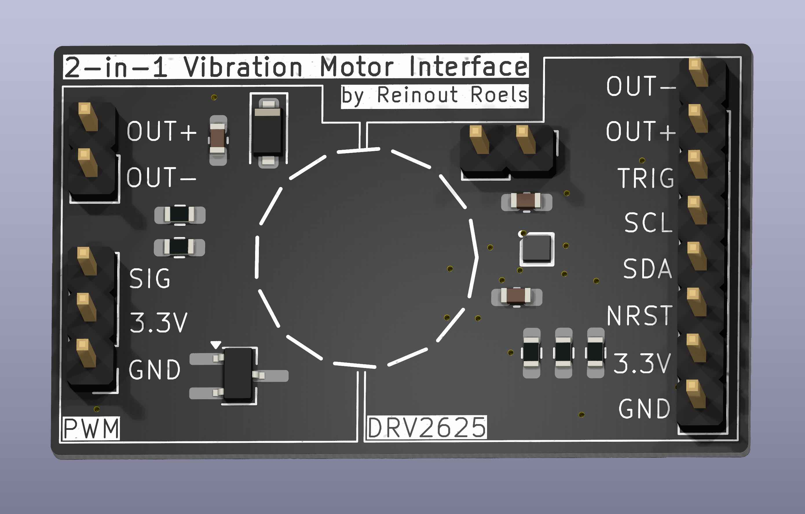
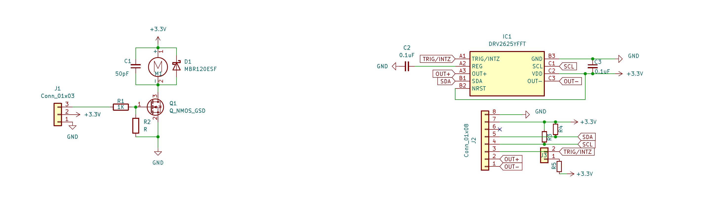
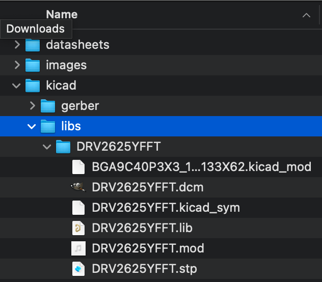

# 2-in-1 Vibration Motor Breakout Board

> [!WARNING]
> The information and material (code, designs, files, ...) are provided "AS IS". We make no representation or warranty of any kind, express or implied, regarding the accuracy, adequacy, validity, reliability, availability, or completeness of any information or material. Use this at your own risk.

> [!WARNING]
> At the time of writing this PCB has not even been produced yet, and as such, it has not even been tested yet! Once it has been properly tested, I will confirm that everything works as expected.

## Introduction

This is a breakout board for small vibration motors, such as those used in (smart)watches.

It is 2-in-1, because it provides two ways to interface with the motor:

* via PWM
* via the Texas Instruments DRV2625 Haptic Driver IC

## Change Log

* v1.0
  * Initial design 

## Design Considerations

* NRST is not connected to the chip, as I was not able to route the NRST pin out of the tiny BGA footprint. This is however an optional feature anyway. 

## Schematics 

## How to Obtain the Physical PCB

The Gerber file is in this repository (`kicad/gerber/vibration-motor.zip`). Simply upload this file a PCB manufacturer of your choice (JLPCB, PCBWay, ...), and you they will make it for you for as low as \$5 for 5 pieces (with the cheapest shipping option, which can take a few weeks).

For JLCPCB, select the order number option where they will replace "JLCJLCJLCJLC" on the board with the actual order number.

> [!WARNING]
> Note that will still have to solder the components onto the PCB yourself!

## How to Edit Design

Everything you need to edit this design in KiCad 8 is included in the repository.

However, this project uses symbols, footprints and 3D models from [Component Search Engine](https://componentsearchengine.com/). Their license allows us to do pretty much whatever we want with them, except redistributing them. For this reason I can't include them in this repository.

If you would like to edit the design yourself, you will need to download the following component libraries from [https://componentsearchengine.com/](https://componentsearchengine.com/) (it's free!):

* [https://componentsearchengine.com/part-view/DRV2625YFFT/Texas%20Instruments](https://componentsearchengine.com/part-view/DRV2625YFFT/Texas%20Instruments)

From the downloaded zip files, move the content of the `KiCad` and `3D` subfolders into the project structure, so that the end-result looks like this:

The KiCad project is configured to look for these files in these locations, using relative paths, so no changes to the project itself are required.	

## Sources

* [https://www.nordicsemi.com/Products/nPM1300](https://www.nordicsemi.com/Products/nPM1300)
* [https://docs.nordicsemi.com/category/npm1300-category](https://docs.nordicsemi.com/category/npm1300-category)
* [https://shop.pimoroni.com/products/drv2605l-linear-actuator-haptic-breakout](https://shop.pimoroni.com/products/drv2605l-linear-actuator-haptic-breakout)
* [https://hackaday.io/project/169967-nrf52-smartwatch](https://hackaday.io/project/169967-nrf52-smartwatch)
* [https://github.com/sqfmi/watchy-hardware/blob/v3.0/WatchySchematic.pdf](https://github.com/sqfmi/watchy-hardware/blob/v3.0/WatchySchematic.pdf)
* [https://www.hobbyelectronica.nl/product/tril-vibratie-dc-motor-module-v3-7-5-3/](https://www.hobbyelectronica.nl/product/tril-vibratie-dc-motor-module-v3-7-5-3/)
* [https://www.ineedmotors.com/news/how-to-build-a-vibration-motor-circuit-34060799.html](https://www.ineedmotors.com/news/how-to-build-a-vibration-motor-circuit-34060799.html)
* [https://www.precisionmicrodrives.com/ab-001-discrete-driver-circuits-for-vibration-motors](https://www.precisionmicrodrives.com/ab-001-discrete-driver-circuits-for-vibration-motors)

